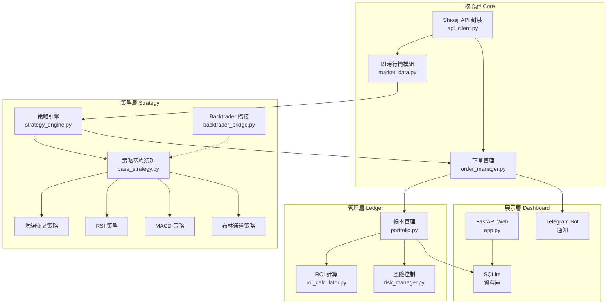

# NeoStock2：自建框架實作計畫（方案 D）

## 概述

基於 Shioaji API 自建自動策略下單框架，搭配 Backtrader 策略標準、FastAPI Web 儀表板、SQLite 儲存、Telegram 通知。

---

## 🏗️ 系統架構



---

## 📁 專案目錄結構

```
NeoStock2/
├── config/
│   ├── settings.yaml          # 系統設定（交易參數、手續費率等）
│   └── .env                   # API Key、Secret、CA 路徑
├── core/
│   ├── __init__.py
│   ├── api_client.py          # Shioaji API 登入/連線封裝
│   ├── market_data.py         # 即時行情訂閱與快照
│   └── order_manager.py       # 下單/改單/刪單管理
├── strategies/
│   ├── __init__.py
│   ├── base_strategy.py       # 策略抽象基底類別
│   ├── strategy_engine.py     # 策略排程與執行引擎
│   ├── backtrader_bridge.py   # Backtrader 策略格式橋接器
│   └── builtin/
│       ├── __init__.py
│       ├── sma_crossover.py   # 雙均線交叉策略
│       ├── rsi_reversal.py    # RSI 超買超賣反轉策略
│       ├── macd_signal.py     # MACD 金叉死叉策略
│       └── bollinger_band.py  # 布林通道突破策略
├── ledger/
│   ├── __init__.py
│   ├── models.py              # SQLAlchemy ORM 模型
│   ├── database.py            # SQLite 連線管理
│   ├── portfolio.py           # 持倉與帳本管理
│   ├── roi_calculator.py      # 投報率計算（含手續費/稅）
│   └── risk_manager.py        # 風險管理（停損/停利/部位上限）
├── dashboard/
│   ├── __init__.py
│   ├── app.py                 # FastAPI 主應用
│   ├── routers/
│   │   ├── market.py          # 行情 API
│   │   ├── trading.py         # 交易 API
│   │   ├── ledger.py          # 帳本 API
│   │   └── strategy.py        # 策略管理 API
│   ├── static/                # 前端靜態檔案
│   │   ├── css/
│   │   └── js/
│   └── templates/
│       └── index.html         # 單頁儀表板
├── notifications/
│   ├── __init__.py
│   └── telegram_bot.py        # Telegram 通知
├── data/                      # SQLite DB 與日誌存放
├── tests/
├── doc/                       # 文件
├── main.py                    # 主程式入口
└── requirements.txt
```

---

## 📋 分階段實作計畫

### 第一期：基礎建設（預計 3-4 個工作天）

#### 1.1 專案初始化
- 建立目錄結構、`requirements.txt`、`.env` 模板
- 依賴：`shioaji`, `fastapi`, `uvicorn`, `sqlalchemy`, `python-telegram-bot`, `backtrader`, `pyyaml`, `python-dotenv`

#### 1.2 核心層 — Shioaji API 封裝
- [api_client.py](file:///c:/Users/Neo/AI_Programming/NeoStock2/core/api_client.py)
  - `ShioajiClient` 類別：登入、CA 驗證、斷線重連
  - 帳戶資訊查詢
- [market_data.py](file:///c:/Users/Neo/AI_Programming/NeoStock2/core/market_data.py)
  - 即時 Tick/BidAsk 訂閱
  - K 棒歷史數據取得
  - 行情快照（最新價格、成交量）
- [order_manager.py](file:///c:/Users/Neo/AI_Programming/NeoStock2/core/order_manager.py)
  - 限價/市價下單
  - 委託狀態追蹤回報
  - 成交回報處理

#### 1.3 帳本層 — 資料庫與基礎帳本
- [models.py](file:///c:/Users/Neo/AI_Programming/NeoStock2/ledger/models.py) — ORM 模型：
  - `Trade` — 交易記錄（股票代碼、方向、價格、數量、時間、手續費、稅）
  - `Position` — 持倉狀態（股票代碼、數量、成本均價）
  - `DailySnapshot` — 每日帳戶快照（總資產、現金、持倉市值）
- [portfolio.py](file:///c:/Users/Neo/AI_Programming/NeoStock2/ledger/portfolio.py)
  - 新增/更新持倉
  - 交易記錄寫入
  - 與券商持倉同步

---

### 第二期：策略引擎（預計 3-4 個工作天）

#### 2.1 策略基底類別
```python
class BaseStrategy(ABC):
    """所有策略的抽象基底"""
    name: str
    params: dict
    
    @abstractmethod
    def on_tick(self, tick_data) -> Signal | None:
        """收到新 Tick 時呼叫，回傳交易訊號或 None"""
        
    @abstractmethod
    def on_bar(self, bar_data) -> Signal | None:
        """收到新 K棒 時呼叫"""
    
    def get_indicators(self) -> dict:
        """回傳當前指標值（供儀表板顯示）"""
```

#### 2.2 四個內建策略
| 策略 | 邏輯 | 參數 |
|------|------|------|
| **雙均線交叉** | 短期 MA 上穿長期 MA → 買入；下穿 → 賣出 | 短期=5, 長期=20 |
| **RSI 反轉** | RSI < 30 → 買入；RSI > 70 → 賣出 | 週期=14, 超買=70, 超賣=30 |
| **MACD 訊號** | MACD 線上穿信號線 → 買入；下穿 → 賣出 | 快=12, 慢=26, 信號=9 |
| **布林通道突破** | 價格觸下軌 → 買入；觸上軌 → 賣出 | 週期=20, 標準差=2 |

#### 2.3 策略引擎
- 多策略並行執行
- 策略訊號聚合與衝突解決
- 策略啟停控制

#### 2.4 Backtrader 橋接器
- 自訂 `ShioajiDataFeed`（繼承 `bt.feed.DataBase`）
- 自訂 `ShioajiBroker`（繼承 `bt.BackBroker`）
- 任何 Backtrader 格式策略可直接在 Shioaji 數據上運行

---

### 第三期：風險管理與 ROI（預計 2 個工作天）

#### 3.1 風險管理
- 單筆停損/停利（百分比或固定金額）
- 單一標的部位上限
- 總帳戶風險 Value at Risk
- 每日最大虧損限額

#### 3.2 ROI 計算
- 含手續費（0.1425%）與證交稅（0.3% 賣出）
- 即時未實現損益
- 已實現損益歷史
- 年化報酬率/夏普比率

---

### 第四期：Web 儀表板（預計 3-4 個工作天）

#### 4.1 FastAPI 後端 API
| 端點 | 功能 |
|------|------|
| `GET /api/market/{symbol}` | 個股即時行情 |
| `GET /api/positions` | 當前持倉 |
| `GET /api/trades` | 交易記錄 |
| `GET /api/portfolio/summary` | 帳戶總覽（ROI、淨值曲線） |
| `GET /api/strategies` | 策略列表與狀態 |
| `POST /api/strategies/{id}/toggle` | 啟停策略 |
| `POST /api/order` | 手動下單 |
| `GET /api/risk` | 風險指標 |

#### 4.2 前端儀表板
- 深色主題，現代化設計
- 即時行情面板（WebSocket 推送）
- 持倉概覽與 ROI 圖表
- 策略管理面板（啟停、參數調整）
- 交易記錄表格

---

### 第五期：Telegram 通知（預計 1 個工作天）

- 成交回報即時推送
- 策略訊號提醒
- 每日損益彙報
- 風險警報（停損觸發等）

---

## 驗證計畫

### 自動化測試
- 各模組單元測試
- 策略回測驗證（使用歷史 K 棒數據）

### 手動驗證
- 模擬模式下完整交易流程
- Web 儀表板即時行情顯示
- Telegram 通知發送確認

---

## User Review Required

> [!IMPORTANT]
> 請確認此實作計畫是否符合您的期望，或有任何調整需求？
> 確認後我將從**第一期：基礎建設**開始實作。
