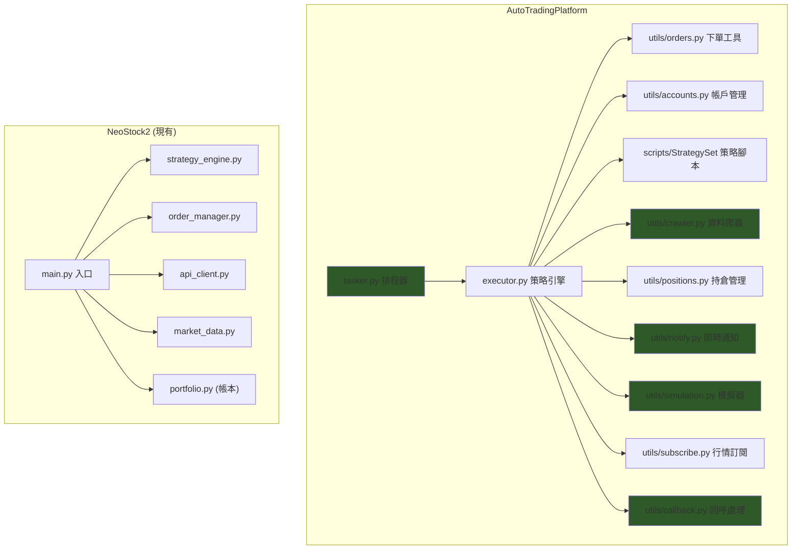

# NeoStock2 vs AutoTradingPlatform — 全面對比分析報告

> 參考專案：[chrisli-kw/AutoTradingPlatform](https://github.com/chrisli-kw/AutoTradingPlatform)
> 分析日期：2026-02-23

---

## 一、Shioaji API 使用方式對比

### 1.1 回呼機制（最關鍵差異）

| 面向 | AutoTradingPlatform ✅ | NeoStock2 ⚠️ |
|------|----------------------|-------------|
| 回呼入口 | **區分** `OrderState.StockOrder`、`StockDeal`、`FuturesOrder`、`FuturesDeal`，各走不同處理 | 統一 `_process_order_event` 一個方法處理所有 |
| 帳戶過濾 | 回呼中 **先檢查 account_id**，非本帳戶直接 `return` | ❌ 未過濾 account_id |
| 委託 vs 成交 | **明確分開**：`StockOrder` 更新委託、`StockDeal` 記帳 | 用 `status in ["Filled"]` 判斷，已修復 Enum 問題 |

> [!IMPORTANT]
> AutoTradingPlatform 用 `constant.OrderState` 的四種 Enum 值來判斷事件型態，這是 Shioaji 官方推薦作法。NeoStock2 目前把所有事件混在一起解析，容易出現格式不匹配的邊界問題。

### 1.2 下單流程

| 面向 | AutoTradingPlatform | NeoStock2 |
|------|-------------------|-----------|
| 價格來源 | 從 **五檔報價 BidAsk** 取得即時 bid/ask | 由使用者手動輸入或策略指定 |
| 批次下單 | 大量委託 **拆單**（每次最多 5 張） | 一次性全數下單 |
| 零股/整股 | **自動判斷** 數量 < 1000 股 → 零股 | 固定由設定檔決定 |
| 融資融券 | 完整支援 `order_cond`（Cash/MarginTrading/ShortSelling） | ❌ 未支援 |
| 處置股處理 | 處置股 **自動改限價** | ❌ 未處理 |
| 市價/限價切換 | 尾盤自動改限價（`TimeSimTradeStockEnd`） | 固定由使用者選擇 |

### 1.3 帳戶管理

| 面向 | AutoTradingPlatform | NeoStock2 |
|------|-------------------|-----------|
| 登入重試 | **5 次重試 + 5 秒間隔** | 單次嘗試 |
| 多帳戶 | 支援多帳戶切換 `set_default_account` | ❌ 單帳戶 |
| 交割查詢 | `api.settlements()` 查 T/T+1/T+2 | ❌ 未實作 |
| 帳務持久化 | 每日帳務存 Excel | ❌ 僅 DB 記錄交易 |
| 24hr 重連 | Token 過期自動重登 | ❌ 未實作 |

---

## 二、自動下單系統不足之處（12 項）

### 🔴 P0 — 必須修復（影響交易正確性）

#### 1. 回呼未區分 OrderState 類型
**現狀**：所有事件走同一解析邏輯，需猜測資料格式
**參考**：用 `constant.OrderState.StockOrder/StockDeal` 明確分流

#### 2. 未驗證 account_id
**風險**：若有多帳戶，可能收到非本帳戶的委託回報，導致錯誤記帳

#### 3. 無登入重試與自動重連
**風險**：網路閃斷或 Token 24hr 過期後，系統無法自動恢復
**參考**：AutoTradingPlatform 有 5 次重試 + `auto_reconnect` 機制

---

### 🟡 P1 — 建議儘快加入（影響交易效率）

#### 4. 無五檔報價驅動定價
**現狀**：限價單由使用者手動設定價格
**建議**：訂閱 BidAsk，買入用 ask_price、賣出用 bid_price，提高成交率

#### 5. 無批次拆單機制
**風險**：大量委託一次送出可能被券商拒絕
**參考**：AutoTradingPlatform 每次最多下 5 張，迴圈送單

#### 6. 無市場時間排程
**現狀**：手動啟停
**建議**：新增 `Scheduler`，自動區分盤前（清帳戶）、盤中（執行策略）、盤後（結算）

#### 7. 無交割資訊查詢
**功能缺口**：無法查看 T+1/T+2 交割金額
**參考**：`api.settlements(api.stock_account)`

---

### 🟢 P2 — 提升完整度（策略調整工具）

#### 8. 策略模組化不足
**現狀**：4 個固定策略寫在 `strategies/` 中，加新策略需改程式碼
**參考**：AutoTradingPlatform 的 `scripts/StrategySet/` 目錄，任意 `.py` 自動載入

#### 9. 無選股機制
**功能缺口**：無法根據技術面/基本面自動篩選標的
**參考**：AutoTradingPlatform 有完整的 `picker` 選股模組

#### 10. 無風控層
**缺失功能**：
- 單筆最大金額限制
- 總持倉上限
- 單日最大虧損停損
- 融資配額不足自動改現股

#### 11. 合約快取不完整
**現狀**：每次透過 `api.Contracts.Stocks` 取得合約
**建議**：參考 AutoTradingPlatform 將合約資訊存入 DB，避免重複查詢

#### 12. Telegram/LINE 通知未整合
**現狀**：`.env` 中有 Telegram 欄位但未實作
**參考**：AutoTradingPlatform 有完整的即時委託/成交推播

---

## 三、架構對比圖

> 綠色標示 = NeoStock2 尚未有的模組

---

## 四、優先建議行動路線

| 優先順序 | 項目 | 預估工時 |
|---------|------|---------|
| 1 | 回呼分流（用 OrderState 區分 Order/Deal） | 2-3 hr |
| 2 | 登入重試 + Token 重連 | 1 hr |
| 3 | 五檔報價定價 + 市場時間排程 | 3-4 hr |
| 4 | 風控層（金額限制、持倉上限、停損） | 3-4 hr |
| 5 | 策略熱載入（目錄掃描自動註冊） | 2 hr |
| 6 | Telegram 通知整合 | 2 hr |
| 7 | 選股機制 | 4-6 hr |
