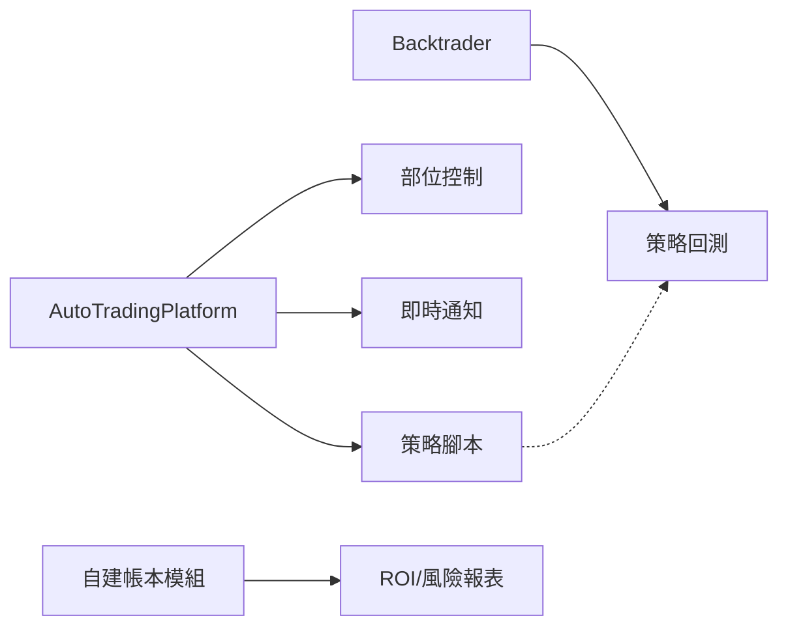
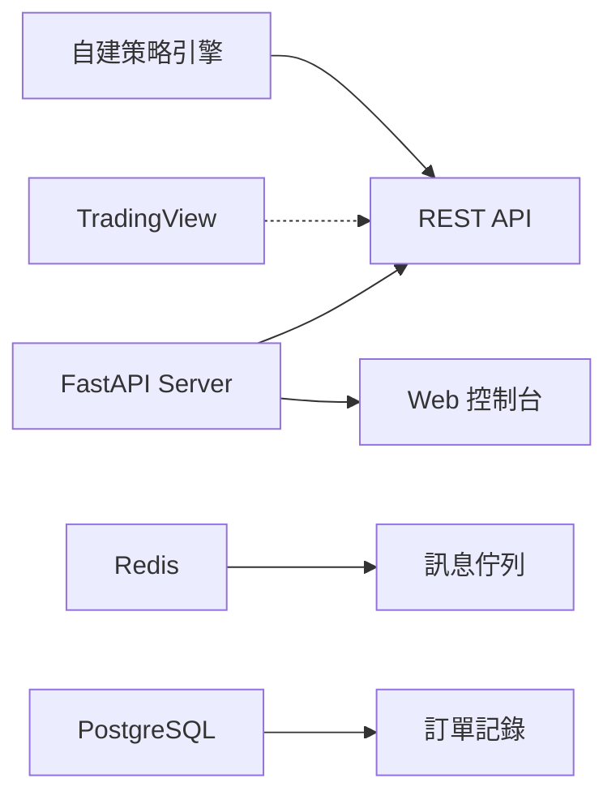
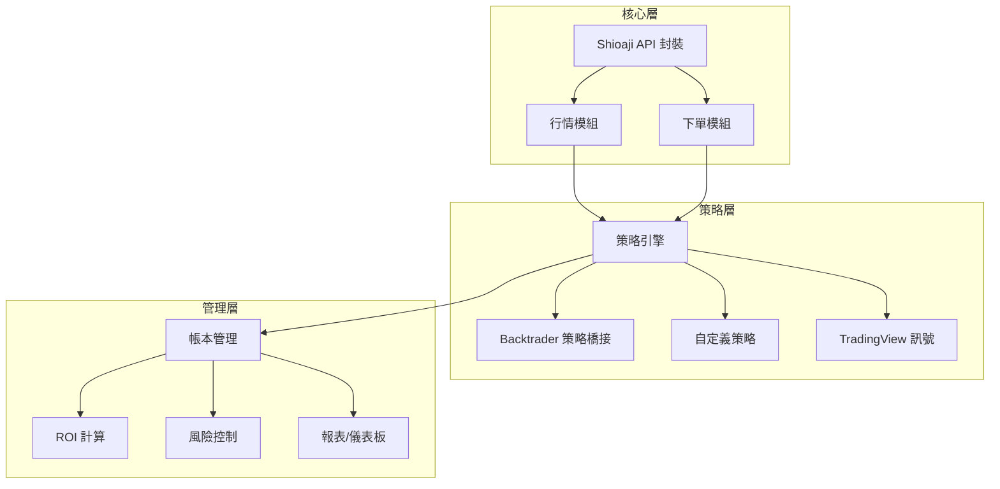

# NeoStock2：永豐 Shioaji 自動策略下單工具 — 研究報告與架構建議

## 📋 研究背景

基於永豐金證券 Shioaji API，開發一套自動策略下單工具，核心需求：
1. **即時資訊** — 查看個股即時行情
2. **帳本管理** — 投報率(ROI)計算與風險管理
3. **策略套用** — 標準化方式快速套用現有交易策略

---

## 🔍 開源專案研究結果

### 一、Shioaji 生態系專案

| 專案 | ⭐ | 特點 | 適用性 |
|------|-----|------|--------|
| [Shioaji](https://github.com/Sinotrade/Shioaji) | 228⭐ | 官方 API，C++ 核心 + FPGA 事件代理，支援股/期/選 | ✅ **核心依賴** |
| [mcp-server-shioaji](https://github.com/Sinotrade/mcp-server-shioaji) | 新 | MCP Server，提供 AI 助手存取行情工具 | ⚡ AI 輔助整合 |
| [AutoTradingPlatform](https://github.com/chrisli-kw/AutoTradingPlatform) | ~30⭐ | **最接近需求**：部位控制、技術指標、選股、Telegram通知、全自動交易 | ✅ **重點參考** |
| [shioaji-api-dashboard](https://github.com/luisleo526/shioaji-api-dashboard) | 新 | FastAPI + Docker + Redis + PostgreSQL，TradingView Webhook 整合 | ✅ **架構參考** |
| [vnpy_sinopac](https://github.com/ypochien/vnpy_sinopac) | 37⭐ | vn.py 永豐接口，支援股/期/選 | ⚠️ 需整合 vn.py 框架 |

### 二、通用量化交易/回測框架

| 框架 | ⭐ | 類型 | 特點 | 適用性 |
|------|-----|------|------|--------|
| [Backtrader](https://github.com/mementum/backtrader) | 14k+ | 事件驅動 | 成熟穩定、文件豐富、社群活躍、支援即時交易 | ✅ **策略+回測首選** |
| [vectorbt](https://github.com/polakowo/vectorbt) | 4k+ | 向量化 | 高速回測、進階分析、但不支援即時交易 | ⚡ 回測加速用 |
| [Backtesting.py](https://github.com/kernc/backtesting.py) | 5k+ | 混合 | 輕量級、互動式圖表、快速原型 | ⚡ 快速驗證用 |
| [vn.py (VeighNa)](https://github.com/vnpy/vnpy) | 25k+ | 事件驅動 | 最完整框架、**已支援永豐接口**、中文社群 | ⚠️ 學習曲線陡 |

### 三、台股專用平台

| 平台 | 特點 | 適用性 |
|------|------|--------|
| **TQuant Lab** | 一站式量化環境，支援台股數據 | ⚡ 數據源參考 |
| **FinLab** | 台灣量化交易平台，本地化數據 | ⚡ 部分功能付費 |

---

## 🏆 推薦方案比較

### 方案 A：基於 AutoTradingPlatform 改造 ⭐ 推薦



**優點：**
- 已封裝 Shioaji API，開箱即用
- 策略腳本標準化（放在 `trader/scripts/` 目錄）
- 已有部位控制、技術指標、選股功能
- 搭配 Backtrader 補足回測能力

**缺點：**
- 回測功能尚未完善（標記 "to be updated"）
- 帳本管理需自行擴充
- 程式碼品質與文件待評估

**需自行開發：**
- 帳本管理模組（ROI、盈虧追蹤）
- 風險管理儀表板
- 與 Backtrader 的策略橋接層

---

### 方案 B：基於 shioaji-api-dashboard 擴展



**優點：**
- 現代化架構（FastAPI + Docker + Redis + PostgreSQL）
- 已有 Web 控制台（委託紀錄、持倉狀態）
- TradingView Webhook 整合（可直接用 TV 的策略訊號）
- Docker 一鍵部署

**缺點：**
- 主要針對期貨，股票支援需擴充
- 無本地策略引擎，依賴外部策略源
- 無回測功能

**需自行開發：**
- 本地策略引擎
- 帳本管理與 ROI 計算
- 股票交易支援

---

### 方案 C：基於 vn.py 全套框架

**優點：**
- 最完整的量化交易框架（25k⭐）
- 已有永豐接口 (`vnpy_sinopac`)
- 內建回測引擎、風險管理、帳本管理
- 社群龐大，策略資源豐富

**缺點：**
- 學習曲線最陡
- 框架龐大，過於複雜
- 永豐接口維護者獨立，更新頻率不確定
- 主要面向中國市場，台灣適配度需驗證

---

### 方案 D：自建框架 + Shioaji 直接整合 ⭐⭐ 最推薦



**優點：**
- 完全掌控架構，按需求量身打造
- 可借鑑 AutoTradingPlatform 的策略腳本模式
- 可借鑑 shioaji-api-dashboard 的現代化架構模式
- 搭配 Backtrader 實現策略標準化與回測
- 最適合長期維護與擴展

**架構設計：**

```
NeoStock2/
├── config/                    # 設定檔
│   ├── settings.yaml          # 系統設定
│   └── .env                   # 敏感資訊（API Key 等）
├── core/                      # 核心模組
│   ├── api_client.py          # Shioaji API 封裝
│   ├── market_data.py         # 即時行情管理
│   └── order_manager.py       # 下單管理
├── strategies/                # 策略模組
│   ├── base_strategy.py       # 策略基底類別
│   ├── backtrader_bridge.py   # Backtrader 策略橋接
│   ├── builtin/               # 內建策略
│   │   ├── ma_crossover.py    # 均線交叉
│   │   ├── rsi_strategy.py    # RSI 策略
│   │   └── macd_strategy.py   # MACD 策略
│   └── custom/                # 使用者自訂策略
├── ledger/                    # 帳本管理
│   ├── portfolio.py           # 投資組合
│   ├── roi_calculator.py      # 投報率計算
│   └── risk_manager.py        # 風險管理
├── dashboard/                 # 儀表板
│   ├── app.py                 # FastAPI/Flask Web 介面
│   └── templates/             # 網頁模板
├── data/                      # 數據存儲
│   ├── kbars/                 # K棒歷史數據
│   └── trades/                # 交易記錄
├── notifications/             # 通知模組
│   ├── telegram_bot.py        # Telegram 通知
│   └── line_notify.py         # LINE 通知
├── tests/                     # 測試
├── main.py                    # 主程式入口
└── requirements.txt           # 依賴
```

---

## 📊 方案對比總結

| 評估項目 | 方案A (AutoTradingPlatform改造) | 方案B (Dashboard擴展) | 方案C (vn.py) | 方案D (自建框架) |
|---------|------|------|------|------|
| **上手速度** | ⭐⭐⭐⭐ | ⭐⭐⭐ | ⭐⭐ | ⭐⭐⭐ |
| **即時行情** | ✅ 已有 | ⚠️ 需擴充 | ✅ 已有 | 需開發 |
| **帳本管理** | ⚠️ 需擴充 | ⚠️ 需擴充 | ✅ 已有 | 需開發 |
| **策略標準化** | ✅ 有腳本結構 | ❌ 依賴外部 | ✅ 完整 | 需開發 |
| **回測能力** | ❌ 待完善 | ❌ 無 | ✅ 完整 | 搭配Backtrader |
| **風險管理** | ✅ 部位控制 | ⚠️ 基礎 | ✅ 完整 | 需開發 |
| **可維護性** | ⭐⭐⭐ | ⭐⭐⭐⭐ | ⭐⭐ | ⭐⭐⭐⭐⭐ |
| **學習曲線** | 低 | 中 | 高 | 中 |
| **靈活度** | ⭐⭐⭐ | ⭐⭐⭐ | ⭐⭐ | ⭐⭐⭐⭐⭐ |

---

## 💡 我的建議

> [!IMPORTANT]
> 考量到您已有 Shioaji 開發經驗（先前對話中已處理過下單、帳本邏輯），我推薦 **方案 D（自建框架）** 搭配以下策略：

1. **核心層**：直接封裝 Shioaji API（您已熟悉）
2. **策略層**：採用 **Backtrader** 的策略標準（市面上最多現成策略可用），透過橋接層轉接到 Shioaji 即時交易
3. **帳本層**：參考 AutoTradingPlatform 的部位控制邏輯，自建 ROI/風險管理
4. **架構層**：參考 shioaji-api-dashboard 的 FastAPI + 資料庫模式
5. **通知層**：整合 Telegram Bot（AutoTradingPlatform 已有範例）

### 關於「套用現有策略」

Backtrader 生態確實有大量現成策略：
- **GitHub 上可搜尋到數百個 Backtrader 策略** — 金叉死叉、RSI 超買超賣、布林通道突破等
- 透過設計一個 `BacktraderBridge`，可以讓任何 Backtrader 格式的策略直接運行在 Shioaji 即時數據上
- TradingView 的 Pine Script 策略也可透過 Webhook 接入

## User Review Required

> [!IMPORTANT]
> 請您確認以下問題，以便我繼續細化實作計畫：

1. **您傾向哪個方案？** 方案 D（自建框架）或其他方案？
2. **前端介面偏好？** Web 儀表板 (FastAPI) 還是純 CLI 先行？
3. **策略優先級？** 先實作哪些內建策略？（均線交叉 / RSI / MACD / 其他）
4. **通知管道偏好？** Telegram / LINE / 都要？
5. **帳本存儲方式？** SQLite（輕量）/ PostgreSQL（較正式）/ JSON 檔案？
6. **您之前的 NeoStock 專案**（先前對話中的帳本邏輯、下單模組）是否要沿用部分程式碼？
